# Range scanner simulation for Blender

This Blender add-on enables you to simulate lidar, sonar and time of flight scanners in your scene. Each point of the generated point cloud is labeled with the object or part id that was set before the simulation. The obtained data can be exported in various formats to use it in machnie learning tasks (see [Examples](#examples) section).

The paper can be found here: https://www.mdpi.com/1424-8220/21/6/2144

## Original scene


The figure shows a group of chairs (left), a Blender camera object and a light source (right). The chair legs and seats are randomly colored differently to make it easier to distinguish them in the following images.

## 3D point clouds


In each of the four figures, a generated, three-dimensional point cloud can be seen. The different colors for each data point have different meanings: 
* top left: original color from object material
* top right: grey scale intensity representation
* bottom left: each color stands for one object category (blue = floor, red = chair)
* bottom right: each color represents one object subcategory (blue = floor, red/green = seats, orange/turquoise = legs)

Note: the left and middle chairs have the same colors because the subobjects were classified identically (see [Classification](#classification)).

Supported formats:
* [.hdf5](https://en.wikipedia.org/wiki/Hierarchical_Data_Format)
* [.csv](https://en.wikipedia.org/wiki/Comma-separated_values)
* [.ply](https://en.wikipedia.org/wiki/PLY_(file_format))
* [.las](https://en.wikipedia.org/wiki/LAS_file_format)

## 2D annotated images


In addition to the 3D points clouds, the add-on can also export 2D images.
* top left: the image rendered from Blenders engine
* top right: depthmap
* bottom left: segmented image
* bottom right: segmented image with bounding box annotations

Supported formats:
* .png
* [pascal voc object descriptions](http://host.robots.ox.ac.uk/pascal/VOC/)

<br /><br />

## Table of Contents
**[Installation](#installation)**<br>
**[Dependencies](#dependencies)**<br>
**[Usage (GUI)](#usage-gui)**<br>
**[Usage (command line)](#usage-command-line)**<br>
**[Visualization](#visualization)**<br>
**[Examples](#examples)**<br>
**[Scene generation](#automatic-scene-generation)**<br>
**[Development](#development)**<br>
**[About](#about)**<br>
**[License](#license)**<br>

<br /><br />

## Installation

It is recommended to use Blender 2.93 LTS. The next LTS will be available with Blender 3.3 (see [here](https://developer.blender.org/project/view/142/)) for which the add-on will be updated. Support for that version is prepared in [this branch](https://github.com/ln-12/blainder-range-scanner/tree/Blender3). Feel free to open an issue if you face problems with Blender 3.x while using that branch. 

*WARNING*: *DO NOT* install the addon via both ways or the two versions are mixed up and cause errors. 

### For GUI usage

1. Clone the repository. This might take some time as the examples are quite large.
2. Zip the `range_scanner` folder.
3. Inside Blender, go to `Edit` -> `Preferences...` -> `Add-ons` -> `Install...` and select the `.zip` file.

### For script usage

1. Clone the repository.
2. Copy the `range_scanner` folder to `Blender 2.93/2.93/scripts/addons_contrib`.

The full installation of Blainder and all dependencies inside a fresh Blender copy can be done using the following commands on Ubuntu:
 
```
sudo apt-get update
sudo apt-get -y install git

wget https://download.blender.org/release/Blender2.93/blender-2.93.6-linux-x64.tar.xz
tar -xf blender-2.93.6-linux-x64.tar.xz

git clone https://github.com/ln-12/blainder-range-scanner.git

mkdir ./blender-2.93.6-linux-x64/2.93/scripts/addons_contrib/
cp -r ./blainder-range-scanner/range_scanner ./blender-2.93.6-linux-x64/2.93/scripts/addons_contrib/

./blender-2.93.6-linux-x64/2.93/python/bin/python3.9 -m ensurepip
./blender-2.93.6-linux-x64/2.93/python/bin/python3.9 -m pip install -r ./blainder-range-scanner/range_scanner/requirements.txt

./blender-2.93.6-linux-x64/blender
```

For Windows, you have to run the same commands after installation via PowerShell (as administrator):
```
cd 'C:\Program Files\Blender Foundation\Blender 2.93\'
.\2.93\python\bin\python.exe -m ensurepip
 
.\2.93\python\bin\python.exe -m pip install -r <Path-To-Blainder>\blainder-range-scanner\range_scanner\requirements.txt
```

<br /><br />

## Dependencies
To use this add-on, you need to install 
* [laspy](https://github.com/laspy/laspy)
* [h5py](https://github.com/h5py/h5py)
* [pascal_voc_writer](https://github.com/AndrewCarterUK/pascal-voc-writer)
* [pypng](https://github.com/drj11/pypng)

This add-on makes use of the following projects:
* [blender-python-examples](https://github.com/robertguetzkow/blender-python-examples), licensed under [GPLv3](https://github.com/robertguetzkow/blender-python-examples/blob/master/LICENSE)

### Automatic installation

After installing the add-on, you see the panel shown below to install the missing dependencies. You might need administrative priviledges to perfom this action ([more info](https://github.com/robertguetzkow/blender-python-examples/tree/master/add_ons/install_dependencies)).


### Manual installation

Open a terminal (as admin on Windows) and navigate into `blainder-range-scanner/range_scanner`. Then run on of the following commands depending on your system.

Windows
```
"C:\Program Files\Blender Foundation\Blender 2.93\2.93\python\bin\python.exe" -m pip install -r requirements.txt
```

*WARNING*: Make sure that the packages are installed inside `C:\program files\blender foundation\blender 2.93\2.93\python\lib\site-packages`, not `C:\users\USER\appdata\roaming\python\python39\site-packages\` or Blender won't find them!

macOS
```
/Applications/Blender.app/Contents/Resources/2.93/python/bin/python3.9m -m pip install -r requirements.txt
```

<br /><br />

## Usage (GUI)

In Blenders 3D View, open the sidebar on the right (click on the little `<`) and select `Scanner`.

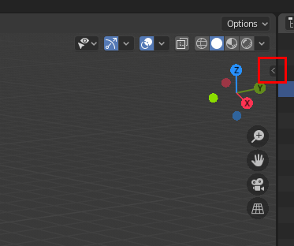

If necessary, install the required dependencies (see [Automatic installation](#automatic-installation)).

Please note that not all of the following options are available for all scanner types.

<br />

### Gerneral settings

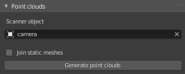

#### Scanner object

Select the object in the scene which should act as range sensor. This object must be of type `camera`.

#### Join static meshes

If enabled, all static meshes in the scene are joined into one mesh prior to the simulation.

#### Generate point clouds

This operator starts the actual scanning process. You should set all parameters (see the following sections) before you hit the button. It is generally recommended to open the command window to see any warning or errors occuring during simulation.

<br />

### Presets

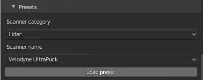

#### Scanner category / name

In this section you can select a predefined sensor. First, choose one of the categories `Lidar`, `Sonar` or `Time of flight`. Then you can select a specific sensor. 

#### Load preset

When pressing `Load preset`, all parameters are applied automatically.

<br />

### Scanner

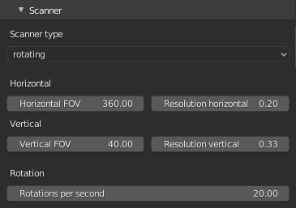

#### Scanner type

The scanner type lets you define the operation mode of the sensor. Depending on the selected type, you can further specify the characteristics of the sensor. 

#### Field of view (FOV) / Resolution

The fields of view define the area which is covered by the scan horizontally and vertically. The resolution indicates the angle between to measurements.

#### Rotation

In case of rotating sensors, the number of rotations per seconds is used to simulate correct measurements during animations.

<br />

In the case of the `sideScan` scanner type, you can set additional parameters ([more info](https://dosits.org/science/advanced-topics/sonar-equation/)) and define the water profile for this scene.

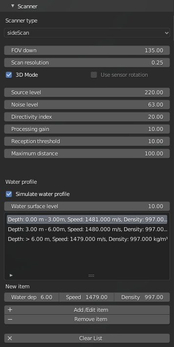

#### Water profile

The `water surface level` defines the z coordinate in your scene which is refered as a water depth of 0 meters. In the table below, you can fill in values for different water layers. Keep in mind to always start with a layer at 0m depth. This approach is used to quickly adjust the water level without the need to move the whole scene.


Example: you set a water surface level of z = 10 and add three layers at a depth of 0m, 3m and 6m. This means there is a layer between 0-3 m, another one between 3-6 m and a last layers which starts at 6 m depth and is infinitely deep (until it hits the bottom). Related to the scene's z coordinate, this means that you have borders between the layers at z = 7 and z = 4. 

<br />

### Reflectivity

The minimum reflectivity needed to capture a reflected ray is approximated by the following model. At a distance of d<sub>min</sub> a reflectivity of r<sub>min</sub> is needed, while at d<sub>max</sub> the reflectivity needs to be greater than r<sub>max</sub> . Measurement below d<sub>min</sub> are captured as long as the reflectivity is >0. For distances above d<sub>max</sub> , no values are registered.

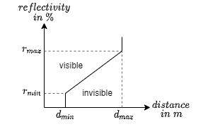

The following panel lets you define the parameters.


You can set the minimum and maximum reflectivity for the scene's targets at given distances. 

The maximum reflection depth defines how often a ray can be reflected on surfaces before it gets discarded.

The reflectivity is defined by the material:

#### Diffuse material

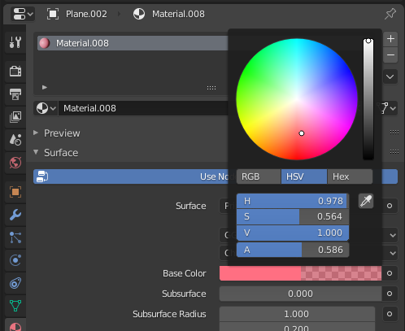

Diffuse material can be defined by changing the `Base Color` attribute of the `Princinpled BSDF` shader. The reflectivity is taken from the `alpha` parameter of a materials color.

#### Texture

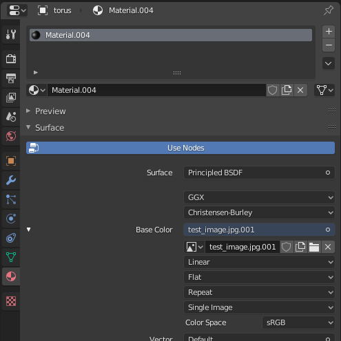

To use a texture, add an `Image texture` node and link it to the input of `Base Color`. 

#### Glass

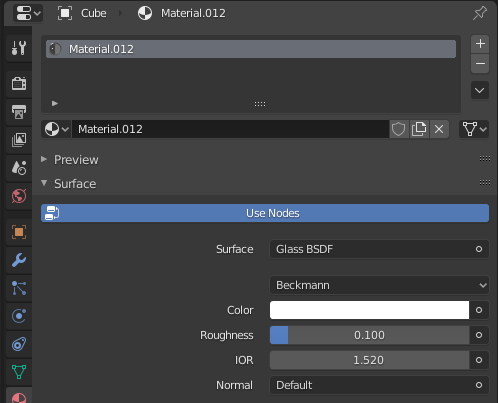

To model glass objects, simply use the `Glass BSDF` shade and set the correct index of refraction with the `IOR` attribute.

#### Mirror

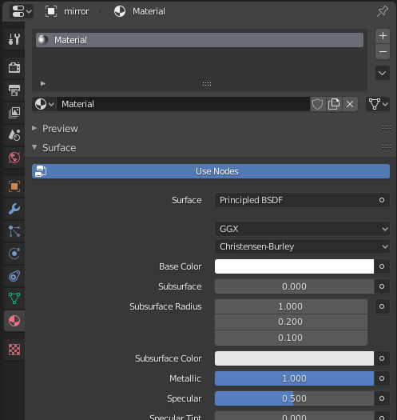

To simulate a fully reflecting surface, you can set the `Metallic` attribute of the `Princinpled BSDF` shader to 1.0.

<br />

### Classification

Objects can beclassified in the two following ways:

#### Via custom properties


Select an object to add a custom property `categoryID` to set the main category (here: chair) and `partID` to set the subcategory (here: legs/plate). If no `categoryID` is provided, the object name is used as the category name instead. If no `partID` is given, the material name is used (see below).

#### Via different materials


The main category has to be set like explained above via `categoryID`. To differentiante parts within a single object, you can select the faces in edit mode and assign a specific material (here: leg/plate). Each subobject with the same material is treated as one category, even if they belong to different objects.

<br />

### Animation


The settings in this panel correspond to the values inside Blenders `Output Properties` tab. You can define the range of frames, the number of skipped frames in each animation step and the number of frames per second (relevant for rotating scanners). Any techniques inside Blender to simulate motion and physics can be applied.

<br />

### Noise

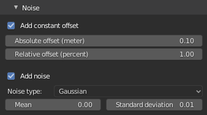

#### Constant offset

The constant offsets are applied to each measurement without any variation. You can choose between an absolute offset which is the same for each distance or a relative offset as percentage of the distance.

#### Random offset

To simulate random errors during the measurement, you can specify the distribution with the given parameters.

<br />

### Weather simulation

#### Rain


To simulate rain, just set the amount of rain in millimeters per hour (see [this paper](https://doi.org/10.3390/electronics8010089)).

#### Dust

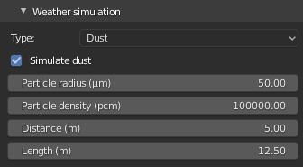

For dust simulation, you can set the parameters to define a dust cloud starting at a given distance and with a given length (see [this paper]( https://doi.org/10.1002/rob.21701)).

<br />

### Visualization


If this setting is enabled, the generated point cloud is added the to Blender scene.

<br />

### Export

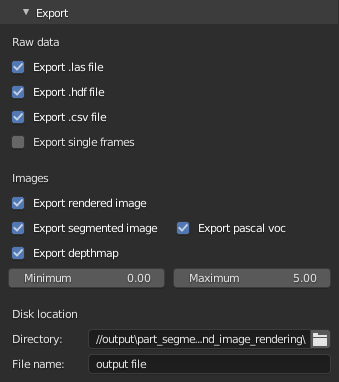

#### Raw data

This add-on can output the generated point clouds as [.hdf5](https://en.wikipedia.org/wiki/Hierarchical_Data_Format), [.csv](https://en.wikipedia.org/wiki/Comma-separated_values), [.ply](https://en.wikipedia.org/wiki/PLY_(file_format)) and [.las](https://en.wikipedia.org/wiki/LAS_file_format) files.

The option `Export single frames` defines if each animation frame should be exported in a separat file or if all steps are exported into a single file.

#### Iages

In the case of `time of flight` sensors, you can furthermore export the rendered image along with a segemented image (including [pascal voc object descriptions](http://host.robots.ox.ac.uk/pascal/VOC/)) and a depthmap. You can specify the value range for the depthmap. All depth values at the minimum are white, whereas values at or above the maximum value appear black. Color values in-between are linearly interpolated.


<br />

### DEBUG

These options are only meant for debugging the add-on. Use them with caution as adding output/line to the process can lead to significant perfomance issues!

<br /><br />

## Usage (command line)
When the code is located inside the `addons_contrib` directory (see [script usage](#script-usage)), you can use the scanner function via script the following way:


```python
import bpy
import range_scanner

# Kinect
range_scanner.ui.user_interface.scan_static(
    bpy.context, 

    scannerObject=bpy.context.scene.objects["Camera"],

    resolutionX=100, fovX=60, resolutionY=100, fovY=60, resolutionPercentage=100,

    reflectivityLower=0.0, distanceLower=0.0, reflectivityUpper=0.0, distanceUpper=99999.9, maxReflectionDepth=10,
    
    enableAnimation=False, frameStart=1, frameEnd=1, frameStep=1, frameRate=1,

    addNoise=False, noiseType='gaussian', mu=0.0, sigma=0.01, noiseAbsoluteOffset=0.0, noiseRelativeOffset=0.0,

    simulateRain=False, rainfallRate=0.0, 

    addMesh=True,

    exportLAS=False, exportHDF=False, exportCSV=False, exportPLY=False, exportSingleFrames=False,
    exportRenderedImage=False, exportSegmentedImage=False, exportPascalVoc=False, exportDepthmap=False, depthMinDistance=0.0, depthMaxDistance=100.0, 
    dataFilePath="//output", dataFileName="output file",
    
    debugLines=False, debugOutput=False, outputProgress=True, measureTime=False, singleRay=False, destinationObject=None, targetObject=None
)       


# Velodyne
range_scanner.ui.user_interface.scan_rotating(
    bpy.context, 

    scannerObject=bpy.context.scene.objects["Camera"],

    xStepDegree=0.2, fovX=30.0, yStepDegree=0.33, fovY=40.0, rotationsPerSecond=20,

    reflectivityLower=0.0, distanceLower=0.0, reflectivityUpper=0.0, distanceUpper=99999.9, maxReflectionDepth=10,
    
    enableAnimation=False, frameStart=1, frameEnd=1, frameStep=1, frameRate=1,

    addNoise=False, noiseType='gaussian', mu=0.0, sigma=0.01, noiseAbsoluteOffset=0.0, noiseRelativeOffset=0.0, 

    simulateRain=False, rainfallRate=0.0, 

    addMesh=True,

    exportLAS=False, exportHDF=False, exportCSV=False, exportPLY=False, exportSingleFrames=False,
    dataFilePath="//output", dataFileName="output file",
    
    debugLines=False, debugOutput=False, outputProgress=True, measureTime=False, singleRay=False, destinationObject=None, targetObject=None
)  


# Sonar
range_scanner.ui.user_interface.scan_sonar(
    bpy.context, 

    scannerObject=bpy.context.scene.objects["Camera"],

    maxDistance=100.0, fovSonar=135.0, sonarStepDegree=0.25, sonarMode3D=True, sonarKeepRotation=False,

    sourceLevel=220.0, noiseLevel=63.0, directivityIndex=20.0, processingGain=10.0, receptionThreshold=10.0,   

    simulateWaterProfile=True, depthList= [
        (15.0, 1.333, 1.0),
        (14.0, 1.0, 1.1),
        (12.5, 1.52, 1.3),
        (11.23, 1.4, 1.1),
        (7.5, 1.2, 1.4),
        (5.0, 1.333, 1.5),
    ],

    enableAnimation=True, frameStart=1, frameEnd=1, frameStep=1,

    addNoise=False, noiseType='gaussian', mu=0.0, sigma=0.01, noiseAbsoluteOffset=0.0, noiseRelativeOffset=0.0, 

    simulateRain=False, rainfallRate=0.0, 

    addMesh=True,

    exportLAS=False, exportHDF=False, exportCSV=False, exportPLY=False, exportSingleFrames=False,
    dataFilePath="//output", dataFileName="output file",
    
    debugLines=False, debugOutput=False, outputProgress=True, measureTime=False, singleRay=False, destinationObject=None, targetObject=None
)  
```

The script can then be run by executing `blender myscene.blend --background --python myscript.py` on the command line.

<br /><br />

## Visualization

All generated data can be shown inside Blender by enabling the `Add datapoint mesh` option inside the `Visualization` submenu. It is also possible to visualize the data as rendered, segmented/labeled and depth images (see [Export](#export)). 

To render .las files the tool [CloudCompare](https://www.cloudcompare.org/) can be used.

You can further use [Potree Desktop](https://github.com/potree/PotreeDesktop) to visualize the raw data. The generated .las files can be converted automatically by dragging it into the window or manually by using the [Potree Converter](https://github.com/potree/PotreeConverter):

```
 .\path\to\potree\PotreeConverter.exe .\path\to\data\data.las -o .\output_directory
```

This will generate a `cloud.js` file which you can drag and drop inside the Potree viewer. 

<br /><br />

## Examples

See [examples folder](./example_scenes/). 

The `.blend` files contain preconfigured scenes. Example outputs are located inside the `output` folder, the used models can be found inside the `models` directory.

<br /><br />

## Automatic scene generation

See [scene generation folder](./scene_generation/).

To generate a random landscape scene, run the following command on the command line:

```
python generate_landscapes.py
```

All parameters can be adjusted inside `landscape.py`. Example scenes are located inside the `generated` folder.

<br /><br />

## Development

This add-on is developed using Visual Studio Code and the Blender extension [blender_vscode](https://github.com/JacquesLucke/blender_vscode).

To run the add-on in debug mode, use the extension and start the addon from there.

If you want to have autocomplete features, consider installing the [fake-bpy-module](https://github.com/nutti/fake-bpy-module) package.

Feel free to fork, modify and improve our work! We would also appreciate to receive contributions in for of pull requests. For that it would be a good idea to open an issue with your idea.

<br /><br />

## About

This add-on was developed by Lorenzo Neumann at [TU Bergakademie Freiberg](https://tu-freiberg.de/fakult1/inf).

Master thesis: *Lorenzo Neumann. "Generation of 3D training data for AI applications by simulation of ranging methods in virtual environments", 2020*.

Paper: Reitmann, S.; Neumann, L.; Jung, B. BLAINDER—A Blender AI Add-On for Generation of Semantically Labeled Depth-Sensing Data. Sensors 2021, 21, 2144. https://doi.org/10.3390/s21062144

<br /><br />

## License

Copyright (C) 2021 Lorenzo Neumann

This program is free software: you can redistribute it and/or modify it under the terms of the GNU General Public License as published by the Free Software Foundation, either version 3 of the License, or (at your option) any later version.

This program is distributed in the hope that it will be useful, but WITHOUT ANY WARRANTY; without even the implied warranty of MERCHANTABILITY or FITNESS FOR A PARTICULAR PURPOSE. See the GNU General Public License for more details.

You should have received a copy of the GNU General Public License along with this program. If not, see https://www.gnu.org/licenses/.

<br />

A brief summary of this license can be found here: https://tldrlegal.com/license/gnu-general-public-license-v3-(gpl-3)
<br />

Commercial license: If you want to use this software without complying with the conditions of the GPL-3.0 license, you can get a custom license for 5.000€ per application instance (= 1 VM or 1 computer). Discounts are possible when purchasing multiple licenses. If you wish to obtain such a license, please feel free to contact me at <a href="mailto:lorenzo.neumann@informatik.tu-freiberg.de?subject=[BLAINDER] License request">lorenzo.neumann@informatik.tu-freiberg.de</a> or via an issue.

<br />

Chair model used: [Low Poly Chair](https://free3d.com/de/3d-model/chair-255345.html)
